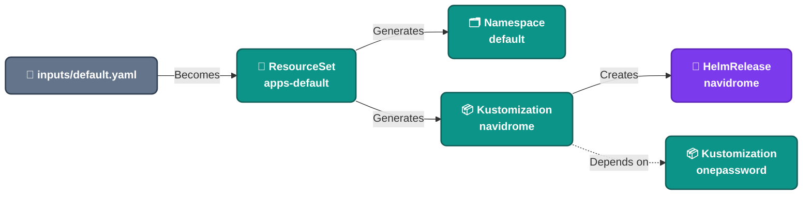

# 🏡 🧪 Home Lab

## 📖 Overview

This mono repository houses the infrastructure for my homelab. I try to adhere to Infrastructure as Code (IaC) and GitOps practices using tools like [Ansible](https://www.ansible.com/), [Terraform](https://www.terraform.io/), [Kubernetes](https://kubernetes.io/), [Flux](https://github.com/fluxcd/flux2), [Renovate](https://github.com/renovatebot/renovate) and [GitHub Actions](https://github.com/features/actions).

## 📂 Layout

```
📁 bootstrap       # One-time cluster bootstrap (helmfile + kustomize)
📁 kubernetes      # Everything Flux reconciles
├─📁 apps          # The catalogue, grouped by namespace
├─📁 components    # Reusable Kustomize components
├─📁 sources       # Where the charts come from, shared by every cluster
└─📁 clusters      # One directory per cluster
  └─📁 home
    ├─📁 entrypoint  # The FluxInstance and the root Kustomization
    ├─📁 inputs      # What this cluster runs, one file per namespace
    └─📁 secrets     # SOPS, only what is needed before the secret store is up
📁 talos           # Talos machine configs and per-node overrides
📁 terraform       # Providers that live outside the cluster
```

## ♻️ GitOps workflow

A cluster declares what it runs in `clusters/<name>/inputs`, one file per namespace. [flux-operator](https://github.com/controlplaneio-fluxcd/flux-operator) turns each of those into a Flux `Kustomization` per app, all from the same template, which is what keeps `apps/` a catalogue that knows nothing about the clusters consuming it.

1. The `FluxInstance` syncs `clusters/home/entrypoint`, where the root Kustomization lives.
2. That applies the rest of `clusters/home` — the shared sources, the SOPS secrets and the `ResourceSet`s.
3. A Kustomize component patches the same template into every one of them.
4. flux-operator expands each `ResourceSet` into its `Namespace` and a Kustomization per app.
5. Each of those applies `apps/<namespace>/<app>`, waiting on whatever its `dependsOn` names.


```mermaid
graph LR
    classDef file fill:#64748B,stroke:#334155,stroke-width:2px,color:#fff,font-weight:bold,rx:8,ry:8
    classDef kustom fill:#0D9488,stroke:#115E59,stroke-width:2px,color:#fff,font-weight:bold,rx:8,ry:8
    classDef helm fill:#7C3AED,stroke:#5B21B6,stroke-width:2px,color:#fff,font-weight:bold,rx:8,ry:8

    A["📄 inputs/default.yaml"]:::file
    B["🧩 ResourceSet<br/>apps-default"]:::kustom
    N["🗂️ Namespace<br/>default"]:::kustom
    C["📦 Kustomization<br/>navidrome"]:::kustom
    E["🎯 HelmRelease<br/>navidrome"]:::helm
    G["📦 Kustomization<br/>onepassword"]:::kustom

    A -->|Becomes| B
    B -->|Generates| N
    B -->|Generates| C
    C -->|Creates| E
    C -.->|Depends on| G
```

## 📜 Changelog

See my _awful_ commit [main history](https://github.com/oscaromeu/home-ops/commits/main) and [legacy history](https://github.com/oscaromeu/home-ops/tree/d75a6360586de8b5b5c4ff6b553b7512cfea5007)

## :handshake:&nbsp; Gratitude and thanks

Thanks all the people of [Home Operations](https://discord.gg/home-operations) Discord community who put a lot of effort and donate their time to the community.

## 🔏 License

See [LICENSE](./LICENSE) v.g WTF License
