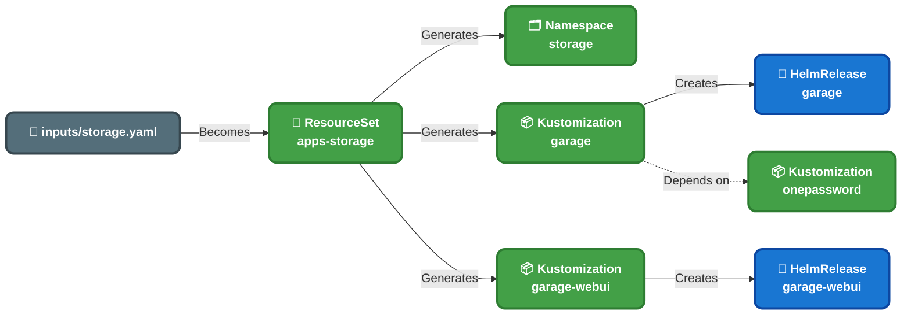

# 🏡 🧪 Home Lab

## 📖 Overview

This mono repository houses the infrastructure for my homelab. I try to adhere to Infrastructure as Code (IaC) and GitOps practices using tools like [Ansible](https://www.ansible.com/), [Terraform](https://www.terraform.io/), [Kubernetes](https://kubernetes.io/), [Flux](https://github.com/fluxcd/flux2), [Renovate](https://github.com/renovatebot/renovate) and [GitHub Actions](https://github.com/features/actions).

## 📂 Layout

```
📁 bootstrap       # One-time cluster bootstrap (helmfile + kustomize)
📁 kubernetes      # Everything Flux reconciles
├─📁 apps          # The catalogue, grouped by namespace
├─📁 components    # Reusable Kustomize components
├─📁 sources       # Where the charts come from, shared by every cluster
└─📁 clusters      # One directory per cluster
  └─📁 home
    ├─📁 entrypoint  # Applied out of band at bootstrap
    ├─📁 inputs      # What this cluster runs, one file per namespace
    └─📁 secrets     # SOPS, only what is needed before the secret store is up
📁 talos           # Talos machine configs and per-node overrides
📁 terraform       # Providers that live outside the cluster
```

## 🔁 GitOps workflow

A cluster declares what it runs in `clusters/<name>/inputs`, one file per namespace, and [flux-operator](https://github.com/controlplaneio-fluxcd/flux-operator) generates the Flux `Kustomization` for every app from a single template. 13 files produce 75 Kustomizations, and `apps/` stays a catalogue that knows nothing about which cluster consumes it.

1. The `FluxInstance` syncs `clusters/home/entrypoint`, which holds the root Kustomization.
2. That applies `clusters/home`: the shared sources, the SOPS secrets, and the 13 `ResourceSet`s.
3. The `resourceset` Kustomize component patches the same template into each of them.
4. flux-operator expands every `ResourceSet` into its `Namespace` and one Kustomization per app.
5. Each Kustomization applies `apps/<namespace>/<app>`, in the order its `dependsOn` declares.


```mermaid
graph LR
    classDef file fill:#546E7A,stroke:#37474F,stroke-width:3px,color:#fff,font-weight:bold,rx:10,ry:10
    classDef kustom fill:#43A047,stroke:#2E7D32,stroke-width:3px,color:#fff,font-weight:bold,rx:10,ry:10
    classDef helm fill:#1976D2,stroke:#0D47A1,stroke-width:3px,color:#fff,font-weight:bold,rx:10,ry:10

    A["📄 inputs/storage.yaml"]:::file
    B["🧩 ResourceSet<br/>apps-storage"]:::kustom
    N["🗂️ Namespace<br/>storage"]:::kustom
    C["📦 Kustomization<br/>garage"]:::kustom
    D["📦 Kustomization<br/>garage-webui"]:::kustom
    E["🎯 HelmRelease<br/>garage"]:::helm
    F["🎯 HelmRelease<br/>garage-webui"]:::helm
    G["📦 Kustomization<br/>onepassword"]:::kustom

    A -->|Becomes| B
    B -->|Generates| N
    B -->|Generates| C
    B -->|Generates| D
    C -->|Creates| E
    D -->|Creates| F
    C -.->|Depends on| G
```

`onepassword` lives in another namespace and another `ResourceSet`, which is the point: `dependsOn` is a graph over apps, not over files.

The catch is that the Kustomizations are never written down, so `flate build` cannot show them. To see what a `ResourceSet` really produces:

```sh
kustomize build --load-restrictor LoadRestrictionsNone kubernetes/clusters/home \
  | yq ea 'select(.metadata.name == "apps-storage")' - \
  | flux-operator build resourceset -f -
```

## 📜 Changelog

See my _awful_ commit [main history](https://github.com/oscaromeu/home-ops/commits/main) and [legacy history](https://github.com/oscaromeu/home-ops/tree/d75a6360586de8b5b5c4ff6b553b7512cfea5007)

## :handshake:&nbsp; Gratitude and thanks

Thanks all the people of [Home Operations](https://discord.gg/home-operations) Discord community who put a lot of effort and donate their time to the community.

## 🔏 License

See [LICENSE](./LICENSE) v.g WTF License
