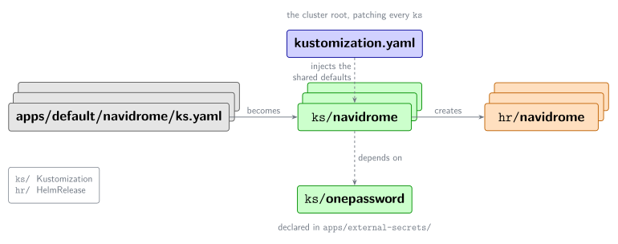

#  Home Lab

##  Overview

This mono repository houses the infrastructure for my homelab. I try to adhere to Infrastructure as Code (IaC) and GitOps practices using tools like [Ansible](https://www.ansible.com/), [Terraform](https://www.terraform.io/), [Kubernetes](https://kubernetes.io/), [Flux](https://github.com/fluxcd/flux2), [Renovate](https://github.com/renovatebot/renovate) and [GitHub Actions](https://github.com/features/actions).

##  Layout

```
📁 bootstrap       # One-time cluster bootstrap (helmfile + kustomize)
📁 kubernetes      # Everything Flux reconciles
├─📁 apps          # The catalogue, grouped by namespace
└─📁 clusters      # One directory per cluster
  └─📁 home
    ├─📁 entrypoint  # The FluxInstance and the root Kustomization
    ├─📁 apps        # What this cluster runs: <namespace>/<app>/ks.yaml
    └─📁 config      # The values this cluster supplies to the catalogue
      ├─📁 namespaces # The Namespaces this cluster creates
      └─📁 secrets   # SOPS, only what is needed before the secret store is up
📁 talos           # Talos machine configs and per-node overrides
📁 terraform       # Providers that live outside the cluster
```

##  GitOps workflow

A cluster declares what it runs in `clusters/<name>/apps`, one Flux `Kustomization` per app, and `apps/` stays a catalogue that knows nothing about which cluster consumes it.

1. The `FluxInstance` syncs `clusters/home/entrypoint`, where the root Flux `Kustomization` lives.
2. That applies the rest of `clusters/home` — the `Namespaces` and SOPS secrets under `config/` and the per-app `Kustomizations` under `apps/`.
3. A Kustomize patch in the cluster root injects the shared defaults (interval, prune, SOPS, substitutions, HelmRelease policy) into every one of them, so each `ks.yaml` only states name, path and its real deviations.
4. Each of those applies `apps/<namespace>/<app>`, waiting on whatever its `dependsOn` names.



##  Changelog

See my _awful_ commit [main history](https://github.com/oscaromeu/home-ops/commits/main) and [legacy history](https://github.com/oscaromeu/home-ops/tree/d75a6360586de8b5b5c4ff6b553b7512cfea5007)

##  Gratitude and thanks

Thanks all the people of [Home Operations](https://discord.gg/home-operations) Discord community who put a lot of effort and donate their time to the community.

##  License

See [LICENSE](./LICENSE) v.g WTF License
